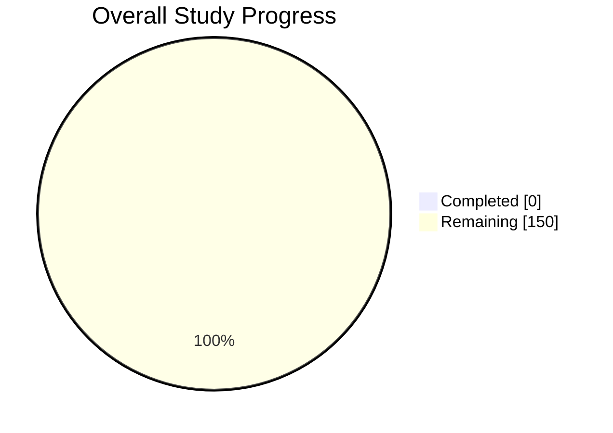

# 🎓 My Study Progress Tracker

> ✅ **Click the checkboxes below on GitHub** — progress bars, percentages, and the pie chart update **automatically** (via GitHub Actions).

<!-- AUTO:SUMMARY:START -->
## 📊 Overall Progress

| Metric              | Value        |
| ------------------- | ------------ |
| **Total Courses**   | 10           |
| **Total Topics**    | 150          |
| **Topics Done**     | 0 / 150      |
| **Overall %**       | `0%` ⬜⬜⬜⬜⬜⬜⬜⬜⬜⬜ |
| **Last Updated**    | 2026-09-24   |

## 🥧 Progress Pie Chart

## 🗂️ Course Dashboard

| #  | Course                             | Done / Total | Progress                   | %    | Status         |
| -- | ---------------------------------- | ------------ | -------------------------- | ---- | -------------- |
| 1  | Data Structures & Algorithms       | 0 / 15       | `⬜⬜⬜⬜⬜⬜⬜⬜⬜⬜`             |   0% | ⬜ Not Started |
| 2  | System Design                      | 0 / 15       | `⬜⬜⬜⬜⬜⬜⬜⬜⬜⬜`             |   0% | ⬜ Not Started |
| 3  | Operating Systems                  | 0 / 15       | `⬜⬜⬜⬜⬜⬜⬜⬜⬜⬜`             |   0% | ⬜ Not Started |
| 4  | Computer Networks                  | 0 / 15       | `⬜⬜⬜⬜⬜⬜⬜⬜⬜⬜`             |   0% | ⬜ Not Started |
| 5  | DBMS & SQL                         | 0 / 15       | `⬜⬜⬜⬜⬜⬜⬜⬜⬜⬜`             |   0% | ⬜ Not Started |
| 6  | Python Programming                 | 0 / 15       | `⬜⬜⬜⬜⬜⬜⬜⬜⬜⬜`             |   0% | ⬜ Not Started |
| 7  | Web Development (MERN)             | 0 / 15       | `⬜⬜⬜⬜⬜⬜⬜⬜⬜⬜`             |   0% | ⬜ Not Started |
| 8  | Machine Learning                   | 0 / 15       | `⬜⬜⬜⬜⬜⬜⬜⬜⬜⬜`             |   0% | ⬜ Not Started |
| 9  | Cloud & DevOps (AWS/Docker)        | 0 / 15       | `⬜⬜⬜⬜⬜⬜⬜⬜⬜⬜`             |   0% | ⬜ Not Started |
| 10 | Git, Linux & Shell Scripting       | 0 / 15       | `⬜⬜⬜⬜⬜⬜⬜⬜⬜⬜`             |   0% | ⬜ Not Started |
<!-- AUTO:SUMMARY:END -->

---

## ✅ Check-off Your Topics

> Click any box below on GitHub → it auto-commits → progress updates in seconds.

<!-- COURSES:START -->

### 📘 Course 1 — Data Structures & Algorithms
- [ ] [Arrays](notes/c1/01-arrays.md)
- [ ] [Strings](notes/c1/02-strings.md)
- [ ] [Linked Lists](notes/c1/03-linked-lists.md)
- [ ] [Stacks](notes/c1/04-stacks.md)
- [ ] [Queues](notes/c1/05-queues.md)
- [ ] [Recursion](notes/c1/06-recursion.md)
- [ ] [Binary Search](notes/c1/07-binary-search.md)
- [ ] [Sorting](notes/c1/08-sorting.md)
- [ ] [Hashing](notes/c1/09-hashing.md)
- [ ] [Trees](notes/c1/10-trees.md)
- [ ] [Binary Search Trees](notes/c1/11-binary-search-trees.md)
- [ ] [Heaps & Priority Queue](notes/c1/12-heaps--priority-queue.md)
- [ ] [Graphs](notes/c1/13-graphs.md)
- [ ] [Dynamic Programming](notes/c1/14-dynamic-programming.md)
- [ ] [Tries & Advanced](notes/c1/15-tries--advanced.md)

### 📗 Course 2 — System Design
- [ ] [Fundamentals & Scaling](notes/c2/01-fundamentals-scaling.md)
- [ ] [Load Balancing](notes/c2/02-load-balancing.md)
- [ ] [Caching (Redis, CDN)](notes/c2/03-caching.md)
- [ ] [Databases SQL vs NoSQL](notes/c2/04-databases-sql-vs-nosql.md)
- [ ] [Sharding & Replication](notes/c2/05-sharding-replication.md)
- [ ] [Message Queues (Kafka, RabbitMQ)](notes/c2/06-message-queues.md)
- [ ] [CAP Theorem](notes/c2/07-cap-theorem.md)
- [ ] [API Design (REST/gRPC)](notes/c2/08-api-design.md)
- [ ] [Microservices](notes/c2/09-microservices.md)
- [ ] [Rate Limiting](notes/c2/10-rate-limiting.md)
- [ ] [Design URL Shortener](notes/c2/11-design-url-shortener.md)
- [ ] [Design Twitter Feed](notes/c2/12-design-twitter-feed.md)
- [ ] [Design WhatsApp](notes/c2/13-design-whatsapp.md)
- [ ] [Design YouTube](notes/c2/14-design-youtube.md)
- [ ] [Design Uber](notes/c2/15-design-uber.md)

### 📙 Course 3 — Operating Systems
- [ ] [Intro & OS Types](notes/c3/01-intro-os-types.md)
- [ ] [Processes & Threads](notes/c3/02-processes-threads.md)
- [ ] [CPU Scheduling](notes/c3/03-cpu-scheduling.md)
- [ ] [Synchronization](notes/c3/04-synchronization.md)
- [ ] [Deadlocks](notes/c3/05-deadlocks.md)
- [ ] [Memory Management](notes/c3/06-memory-management.md)
- [ ] [Paging & Segmentation](notes/c3/07-paging-segmentation.md)
- [ ] [Virtual Memory](notes/c3/08-virtual-memory.md)
- [ ] [File Systems](notes/c3/09-file-systems.md)
- [ ] [Disk Scheduling](notes/c3/10-disk-scheduling.md)
- [ ] [I/O Systems](notes/c3/11-io-systems.md)
- [ ] [Security](notes/c3/12-security.md)
- [ ] [Linux Internals](notes/c3/13-linux-internals.md)
- [ ] [Shell & System Calls](notes/c3/14-shell-system-calls.md)
- [ ] [Case Studies](notes/c3/15-case-studies.md)

### 📕 Course 4 — Computer Networks
- [ ] [OSI & TCP/IP Models](notes/c4/01-osi-tcp-ip-models.md)
- [ ] [Physical Layer](notes/c4/02-physical-layer.md)
- [ ] [Data Link Layer](notes/c4/03-data-link-layer.md)
- [ ] [MAC & Ethernet](notes/c4/04-mac-ethernet.md)
- [ ] [IP Addressing & Subnetting](notes/c4/05-ip-addressing-subnetting.md)
- [ ] [Routing Algorithms](notes/c4/06-routing-algorithms.md)
- [ ] [TCP vs UDP](notes/c4/07-tcp-vs-udp.md)
- [ ] [Congestion Control](notes/c4/08-congestion-control.md)
- [ ] [DNS](notes/c4/09-dns.md)
- [ ] [HTTP / HTTPS](notes/c4/10-http-https.md)
- [ ] [TLS / SSL](notes/c4/11-tls-ssl.md)
- [ ] [Web Sockets](notes/c4/12-web-sockets.md)
- [ ] [Firewalls & NAT](notes/c4/13-firewalls-nat.md)
- [ ] [Wireless & Mobile](notes/c4/14-wireless-mobile.md)
- [ ] [Network Security](notes/c4/15-network-security.md)

### 📓 Course 5 — DBMS & SQL
- [ ] [DBMS Basics & ER Model](notes/c5/01-dbms-basics-er-model.md)
- [ ] [Relational Model](notes/c5/02-relational-model.md)
- [ ] [SQL Basics](notes/c5/03-sql-basics.md)
- [ ] [Joins](notes/c5/04-joins.md)
- [ ] [Aggregations & Group By](notes/c5/05-aggregations-group-by.md)
- [ ] [Subqueries](notes/c5/06-subqueries.md)
- [ ] [Window Functions](notes/c5/07-window-functions.md)
- [ ] [Indexes](notes/c5/08-indexes.md)
- [ ] [Normalization](notes/c5/09-normalization.md)
- [ ] [Transactions & ACID](notes/c5/10-transactions-acid.md)
- [ ] [Concurrency Control](notes/c5/11-concurrency-control.md)
- [ ] [Stored Procedures & Triggers](notes/c5/12-stored-procedures-triggers.md)
- [ ] [NoSQL MongoDB](notes/c5/13-nosql-mongodb.md)
- [ ] [Query Optimization](notes/c5/14-query-optimization.md)
- [ ] [Real-world SQL Problems](notes/c5/15-real-world-sql-problems.md)

### 📔 Course 6 — Python Programming
- [ ] [Syntax & Data Types](notes/c6/01-syntax-data-types.md)
- [ ] [Control Flow](notes/c6/02-control-flow.md)
- [ ] [Functions & Lambdas](notes/c6/03-functions-lambdas.md)
- [ ] [Comprehensions](notes/c6/04-comprehensions.md)
- [ ] [OOP in Python](notes/c6/05-oop-in-python.md)
- [ ] [Modules & Packages](notes/c6/06-modules-packages.md)
- [ ] [File I/O](notes/c6/07-file-i-o.md)
- [ ] [Exception Handling](notes/c6/08-exception-handling.md)
- [ ] [Decorators & Generators](notes/c6/09-decorators-generators.md)
- [ ] [Iterators & Context Managers](notes/c6/10-iterators-context-managers.md)
- [ ] [Multithreading & AsyncIO](notes/c6/11-multithreading-asyncio.md)
- [ ] [NumPy & Pandas](notes/c6/12-numpy-pandas.md)
- [ ] [Regex](notes/c6/13-regex.md)
- [ ] [Testing (pytest)](notes/c6/14-testing-pytest.md)
- [ ] [Mini Projects](notes/c6/15-mini-projects.md)

### 📒 Course 7 — Web Development (MERN)
- [ ] [HTML5 Semantics](notes/c7/01-html5-semantics.md)
- [ ] [CSS3 Flexbox Grid](notes/c7/02-css3-flexbox-grid.md)
- [ ] [JavaScript ES6+](notes/c7/03-javascript-es6.md)
- [ ] [DOM & Events](notes/c7/04-dom-events.md)
- [ ] [React Basics](notes/c7/05-react-basics.md)
- [ ] [React Hooks](notes/c7/06-react-hooks.md)
- [ ] [Redux](notes/c7/07-redux.md)
- [ ] [Next.js](notes/c7/08-next-js.md)
- [ ] [Tailwind CSS](notes/c7/09-tailwind-css.md)
- [ ] [Node.js & Express](notes/c7/10-node-js-express.md)
- [ ] [MongoDB & Mongoose](notes/c7/11-mongodb-mongoose.md)
- [ ] [REST APIs](notes/c7/12-rest-apis.md)
- [ ] [Auth JWT](notes/c7/13-auth-jwt.md)
- [ ] [Deployment](notes/c7/14-deployment.md)
- [ ] [Full-Stack Project](notes/c7/15-full-stack-project.md)

### 📚 Course 8 — Machine Learning
- [ ] [Math for ML](notes/c8/01-math-for-ml.md)
- [ ] [Probability & Statistics](notes/c8/02-probability-statistics.md)
- [ ] [Data Preprocessing](notes/c8/03-data-preprocessing.md)
- [ ] [Linear Regression](notes/c8/04-linear-regression.md)
- [ ] [Logistic Regression](notes/c8/05-logistic-regression.md)
- [ ] [Decision Trees & RF](notes/c8/06-decision-trees-rf.md)
- [ ] [SVM](notes/c8/07-svm.md)
- [ ] [KNN & Naive Bayes](notes/c8/08-knn-naive-bayes.md)
- [ ] [K-Means & Clustering](notes/c8/09-k-means-clustering.md)
- [ ] [PCA](notes/c8/10-pca.md)
- [ ] [Neural Networks](notes/c8/11-neural-networks.md)
- [ ] [CNNs](notes/c8/12-cnns.md)
- [ ] [RNNs LSTMs](notes/c8/13-rnns-lstms.md)
- [ ] [Transformers & LLMs](notes/c8/14-transformers-llms.md)
- [ ] [End-to-End Project](notes/c8/15-end-to-end-project.md)

### ☁️ Course 9 — Cloud & DevOps
- [ ] [Cloud Fundamentals](notes/c9/01-cloud-fundamentals.md)
- [ ] [AWS EC2](notes/c9/02-aws-ec2.md)
- [ ] [AWS S3](notes/c9/03-aws-s3.md)
- [ ] [AWS IAM](notes/c9/04-aws-iam.md)
- [ ] [AWS RDS DynamoDB](notes/c9/05-aws-rds-dynamodb.md)
- [ ] [AWS Lambda & API GW](notes/c9/06-aws-lambda-api-gw.md)
- [ ] [VPC & Networking](notes/c9/07-vpc-networking.md)
- [ ] [CloudWatch](notes/c9/08-cloudwatch.md)
- [ ] [Docker Basics](notes/c9/09-docker-basics.md)
- [ ] [Docker Compose](notes/c9/10-docker-compose.md)
- [ ] [Kubernetes](notes/c9/11-kubernetes.md)
- [ ] [GitHub Actions CI/CD](notes/c9/12-github-actions-ci-cd.md)
- [ ] [Jenkins](notes/c9/13-jenkins.md)
- [ ] [Terraform](notes/c9/14-terraform.md)
- [ ] [Deploy Full App to AWS](notes/c9/15-deploy-full-app-to-aws.md)

### 🐧 Course 10 — Git, Linux & Shell
- [ ] [Git Basics](notes/c10/01-git-basics.md)
- [ ] [Branching & Merging](notes/c10/02-branching--merging.md)
- [ ] [Rebasing & Cherry-pick](notes/c10/03-rebasing--cherry-pick.md)
- [ ] [Git Workflow Fork PR](notes/c10/04-git-workflow-fork-pr.md)
- [ ] [Linux File System](notes/c10/05-linux-file-system.md)
- [ ] [File Permissions](notes/c10/06-file-permissions.md)
- [ ] [Process Management](notes/c10/07-process-management.md)
- [ ] [Package Managers](notes/c10/08-package-managers.md)
- [ ] [Networking Commands](notes/c10/09-networking-commands.md)
- [ ] [Vim Nano](notes/c10/10-vim-nano.md)
- [ ] [Shell Basics](notes/c10/11-shell-basics.md)
- [ ] [Variables & Loops](notes/c10/12-variables--loops.md)
- [ ] [Awk Sed Grep](notes/c10/13-awk-sed-grep.md)
- [ ] [Cron Jobs](notes/c10/14-cron-jobs.md)
- [ ] [Real-world Shell Scripts](notes/c10/15-real-world-shell-scripts.md)

<!-- COURSES:END -->

---

## 🏆 Milestones
- [ ] 🎯 Finish first course
- [ ] 🎯 Reach 25% overall
- [ ] 🎯 Reach 50% overall
- [ ] 🎯 Reach 75% overall
- [ ] 🎯 Complete all 10 courses 🎉

---

> ✍️ *"Small progress is still progress. Keep going."*
